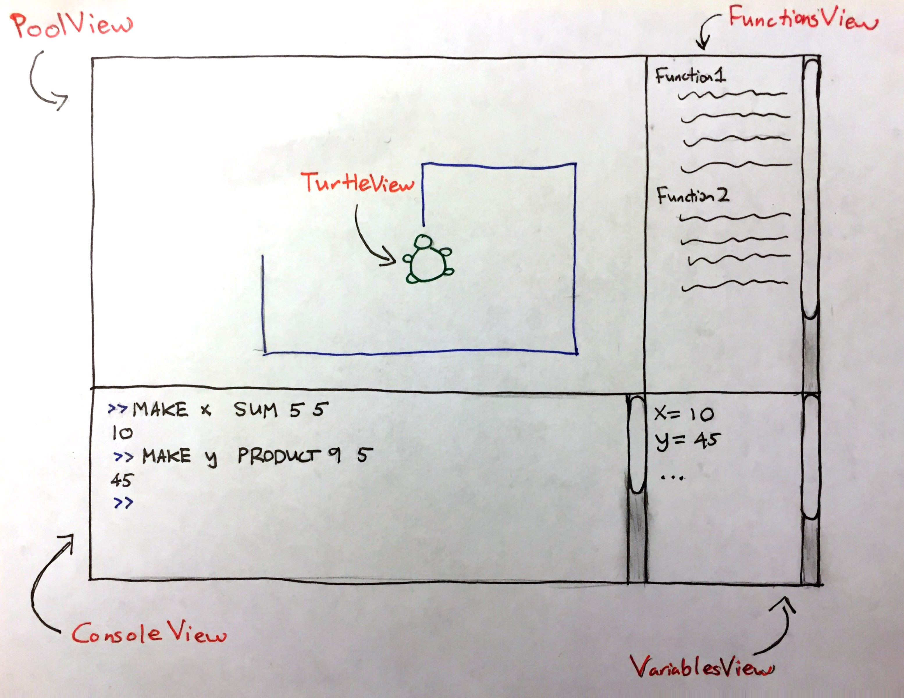

SLogo Design
============

###**Introduction**
The goal of this project is to provide a graphical integrated development environment. We want to design it in a flexible way so that users can define their own commands and variables or change to a different UI based on our core model. For this purpose we will utilize the Model-View-Controller architecture. The model will be closed for modification, but by having an abstract superclass for all commands, it is open for adding new commands. The root level view classes will be closed but new view components can be made and the view framework can be modified to incorporate those changes. The controller is responsible for the communication between model and view and may need to be modified when new view components are added.

###**Design Overview**
We will utilize the Model-View-Controller architecture for the general structure of this project. The view is responsible for taking in user input, displaying the results (either graphical or text) of the commands and enabling users to customize the program to a certain degree. The model is responsible for the logic of the program, in this case mostly parsing and executing the commands users type in.

* The Controller class serves as a platform that facilitates communication between the frontend GUI and backend SLogoModel, since there should not be direct data exchange between the two components.
* The GUI class encompasses and organizes all the front-end components.
The TerminalView class takes users’ command input and displays any non-graphical results of the commands.
* The TurtleView class displays the results of the turtles executing commands displayed visually
* The VariableView and CommandView class displays all the user-defined variables and commands
* The OptionsView class displays the different options provided to the users.
* The SLogoModel class contains and organizes all the back-end components.
* The Interpreter class translates the user input into a root level Command class.
* The TurtlePool class

###**User Interface**

User types in their commands in the ConsoleView; ConsoleView also saves the User history of commands entered, and (for some of the commands) displays the results of their command (eg. “10” for command “SUM 5 5”). TurtleViews are displayed in PoolView at their correct coordinates. FunctionsView displays text representations of any function that have been declared by the User. VariablesView displays text representations of any variables that have been declared by the User. 

Errors are displayed as AlertDialogues reported to the user that display the correct error message (passed from back end). 

###**API Details**

###**API Example Code**

*Example: The user types 'fd 50' in the command window, and sees the turtle move in the display window leaving a trail, and the command is added to the environment's history.*

Front end passes raw user input String (“fd 50”) to Controller, which calls SLogoModel’s interpret() method, which calls Interpreter’s parseCommand() method on the String. This creates an instance of “fd Command”, which takes in value “50” as a parameter, which executes the command on TurtlePool. TurtlePool calls moveTurtle(int ID, double dist) method on the specified turtle (using a unique String id) in the back end. Whenever any of the turtles are updated, notifyObservers() method of Observable class (which TurtlePool extends) notifies PoolView (the observer of TurtlePool) of the update. GUI calls step() method on all of the Views (PoolView, TerminalView, VariablesView, FunctionView, OptionsView). PoolView updates the front end TurtleViews to reflect updated back end. Each TurtleView has a Pen object which draws the trail if it is down. TerminalView stores the user’s String input command in the  environment’s history and updates to notify user that it is ready to accept next command. 

*Example: The user types “LEFT 90” in the command window, and sees the turtle turn 90 degrees left in the display window, and the command is added to the environment's history.*

Front end passes raw user input String (“LEFT 90”) to Controller, which calls SLogoModel’s interpret() method, which calls Interpreter’s parseCommand() method on the String. This creates an instance of “Turn Command”, which takes in value “90” and “left” as parameters, which executes the command on TurtlePool. TurtlePool calls turnTurtle(int ID, double angle) method on the specified turtle (using a unique String id) in the back end. Whenever any of the turtles are updated, notifyObservers() method of Observable class (which TurtlePool extends) notifies PoolView (the observer of TurtlePool) of the update. Controller calls update() on GUI calls step() method on all of the Views (PoolView, TerminalView, VariablesView, FunctionView, OptionsView). PoolView updates the front end TurtleViews to reflect updated back end. TerminalView stores the user’s String input command in the  environment’s history and updates to notify user that it is ready to accept next command. 

*Example: The user types “PENUP” in the command window, and the command is added to the environment's history.*

Front end passes raw user input String (“PENUP”) to Controller, which calls SLogoModel’s interpret() method, which calls Interpreter’s parseCommand() method on the String. This creates an instance of “Pen Command”, which takes in a boolean value as a parameter, which executes the command on TurtlePool. TurtlePool calls setPen(boolean) method on the specified turtle (using a unique String id) in the back end. Whenever any of the turtles are updated, notifyObservers() method of Observable class (which TurtlePool extends) notifies PoolView (the observer of TurtlePool) of the update. Controller calls update() on GUI calls step() method on all of the Views (PoolView, TerminalView, VariablesView, FunctionView, OptionsView). PoolView updates the front end TurtleViews to reflect updated back end; specifically, it updates the TurtleView’s Pen instance. TerminalView stores the user’s String input command in the  environment’s history and updates to notify user that it is ready to accept next command. 

*Example: The user types “SHOWTURTLE” in the command window, and sees the turtle show up in the display window, returns 1 to TerminalView (console) and the command is added to the environment's history.*

Front end passes raw user input String (“SHOWTURTLE”) to Controller, which calls SLogoModel’s interpret() method, which calls Interpreter’s parseCommand() method on the String. This creates an instance of “Show Command”, which takes in a boolean value as a parameter, and executes (through execute()) the command on TurtlePool. The execute() method also returns String “1” and passes to TerminalView. TurtlePool calls setTurtleVisibility(int ID, boolean visibility) method on the specified turtle (using a unique String id) in the back end. Whenever any of the turtles are updated, notifyObservers() method of Observable class (which TurtlePool extends) notifies PoolView (the observer of TurtlePool) of the update. Controller calls update() on GUI calls step() method on all of the Views (PoolView, TerminalView, VariablesView, FunctionView, OptionsView). PoolView updates the front end TurtleViews to reflect updated back end; specifically, it sets TurtleView’s boolean visibility instance variable to “true”, and thus the user will be able to see the turtle’s ImageView on screen. TerminalView displays the String passed from Command’s execute method (“1”), stores the user’s String input command in the  environment’s history, and updates to notify user that it is ready to accept next command. 

*Example: The user types “SUM 1 1” in the command window, returns the result of the summation to TerminalView (console) and the command is added to the environment's history.*

Front end passes raw user input String (“SUM 1 1”) to Controller, which calls SLogoModel’s interpret() method, which calls Interpreter’s parseCommand() method on the String. This creates an instance of “Sum Command”, which takes in “1” as expr1 and “1” as expr2, and executes (through execute()) the command. The execute() method returns String “2” and passes to Controller. Controller calls update() on GUI calls step() method on all of the Views (PoolView, TerminalView, VariablesView, FunctionView, OptionsView) and passes String to TerminalView. TerminalView displays the String passed from Command’s execute method (“2”), stores the user’s String input command in the  environment’s history, and updates to notify user that it is ready to accept next command. 

*Example: The user types “MAKE variable expr” in the command window, and sees the new entry in VariablesView, and the command is added to the environment's history.*

Front end passes raw user input String (“MAKE variable expr”) to Controller, which calls SLogoModel’s interpret() method, which calls Interpreter’s parseCommand() method on the String. This creates an instance of “MakeVariable Command”, which takes in “variable” as variable name and “expr” as the value of the variable, and executes (through execute()) the command. The execute() method returns String “variable = expr” and passes to Controller. Controller calls update() on GUI calls step() method on all of the Views (PoolView, TerminalView, VariablesView, FunctionView, OptionsView) and passes String “variable = expr” from Command to  VariablesView, which adds the text to its display.  PoolView updates the front end TurtleViews to reflect updated back end. Each TurtleView has a Pen object which draws the trail if it is down. TerminalView stores the user’s String input command in the  environment’s history, and updates to notify user that it is ready to accept next command. 

*Example: The user types “XCOR” in the command window, returns the turtle’s x-coordinate to TerminalView (console) and the command is added to the environment's history.*

Front end passes raw user input String (“XCOR”) to Controller, which calls SLogoModel’s interpret() method, which calls Interpreter’s parseCommand() method on the String. This creates an instance of “GET Command”, which takes in “XCOR” as a parameter, and executes (through execute()) the command. The execute() method returns result of Turtle’s getXCor() method and passes to Controller. Controller calls update() on GUI calls step() method on all of the Views (PoolView, TerminalView, VariablesView, FunctionView, OptionsView) and passes String to TerminalView. TerminalView displays the String passed from Command’s execute method eg.  (“50.0”), stores the user’s String input command in the  environment’s history, and updates to notify user that it is ready to accept next command. 

*Example: The user types “SETXY 0 10” in the command window, and user sees the turtle move in the display window leaving a trail, the angle the turtle turned printed in the TerminalView, and the command is added to the environment's history.*

Front end passes raw user input String (“SETXY 0 10”) to Controller, which calls SLogoModel’s interpret() method, which calls Interpreter’s parseCommand() method on the String. This creates an instance of “SETXY Command”, which takes in “0” as x-cor parameter and “10” as y-cor parameter, and executes (through execute()) the command. The execute() method returns result of Turtle’s calculateAngle() method (eg. “50.0”) and passes to Controller and TurtlePool. TurtlePool calls moveTurtle(int ID, double dist) method on the specified turtle (using a unique String id) in the back end. Whenever any of the turtles are updated, notifyObservers() method of Observable class (which TurtlePool extends) notifies PoolView (the observer of TurtlePool) of the update. Controller calls update() on GUI calls step() method on all of the Views (PoolView, TerminalView, VariablesView, FunctionView, OptionsView) and passes String to TerminalView. TerminalView displays the String passed from Command’s execute method eg.  (“50.0”), stores the user’s String input command in the  environment’s history, and updates to notify user that it is ready to accept next command. 

###**Design Considerations**

* One potential issue is to determine how the front end knows what front end turtle representation is associated with what back end turtle instance. 
* Categorizations of commands, how to parse user input Strings into the right Command object and how to represent it. Extendability to include loops, and other more complex commands. 

###**Team Responsibilities**

**Front End**

Wei-Ting Yeh: TurtleViews, PoolView, Pen

Sarah Zhou: Controller, FunctionsView, VariablesView, ConsoleView

**Back End**

Bihan Zhuang: Interpreter, Command

Mike Liu: Turtle, TurtlePool, SLogoModel
