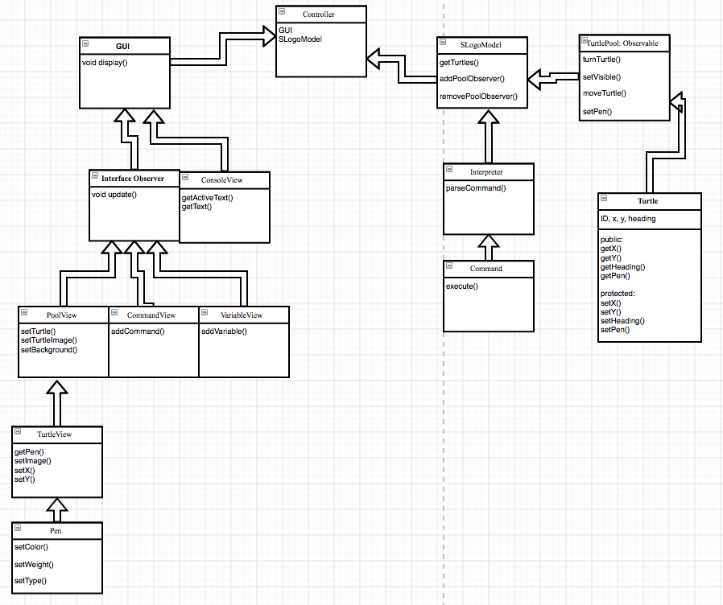
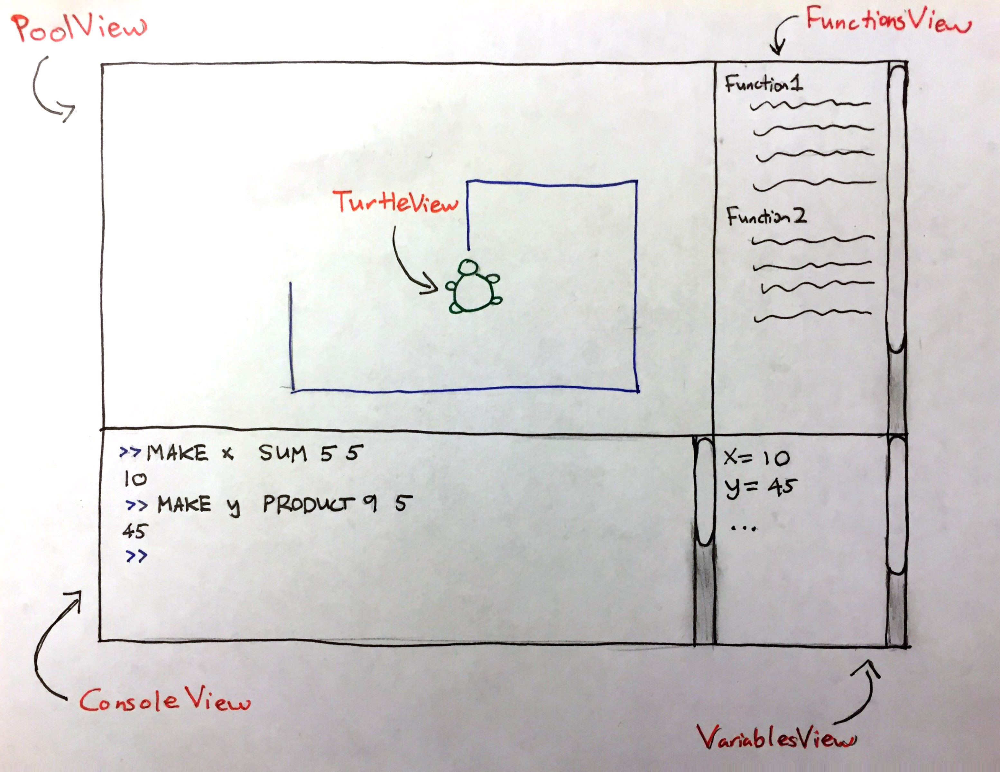

SLogo Design
============

## Introduction
The goal of this project is to provide a graphical integrated development environment. We want to design it in a flexible way
so that users can define their own commands and variables or change to a different UI based on our core model. For this purpose
we will utilize the Model-View-Controller architecture. The model will be closed for modification, but by having an abstract
superclass for all commands, it is open for adding new commands. The root level view classes will be closed but new view
components can be made and the view framework can be modified to incorporate those changes. The controller is responsible for
the communication between model and view and may need to be modified when new view components are added.

## Design Overview
We will utilize the Model-View-Controller architecture for the general structure of this project. The view is responsible for
taking in user input, displaying the results (either graphical or text) of the commands and giving users other options to
customize the program. The model is responsible for the logic of the program, in this case mostly parsing and executing the
commands users type in. And the controller is responsible for the communication between view and model, allowing developers to
work on them separately without worrying about dependencies.

### External APIs
Provides communication between the frontend and backend sub-groups.
* GUI (frontend): 
 * show();
 * Observer getPoolObserver();
 * Observer getCommandObserver();
 * Observer getVariableObserver();
 * void addVariable(String variable);
 * void addCommand(String command);
 * void setTurtle(Collection<Turtle> turtles);
* SLogoModel (backend): 
 * List<String> interpret(List<String> command) throws Exception;
 * void addPoolObserver(Observer o);
 * void removePoolObserver(Observer o);
 * void addCommandObserver(Observer o);
 * void removeCommandObserver(Observer o);
 * void addVariableObserver(Observer o);
 * void removeVariableObserver(Observer o);
 * Collection<Turtle> getTurtles();
 * List<String> getCommands();
 * List<String> getVariables();
* Turtle(backend component). All the external APIs are listed below. However, all the setters will remain hidden: 
 * double getX();
 * double getY();
 * double getHeading();
 * boolean penDown();
 * boolean isVisible();
* The corresponding Views in the frontend and the Pools in the backend are connected through the Observer pattern. All the other
methods will remain hidden.

### Internal APIs

#### Frontend
To add new Views, create new View classes that implements the Observer interface and they are to be initialized in the GUI.
They will also have corresponding backend Pools which extends the Observable class. 

* TurtleView:
 * setImage(ImageView image);
* PoolView:
 * void setTurtle(Collection<Turtle> turtles);
 * void setTurtleImage(ImageView image);
 * void setBackgroundColor(Color color);
* ConsoleView:
 * List<String> getActiveText();
 * void addText(List<String> text);
* VariableView:
 * void addVariable(String variable);
* CommandView:
 * void addCommand(String command);

#### Backend:
New commands can be added by creating new classes that extends the Command superclass. The data structure that stores the
mapping from user input (String) to actual the Command class also needs to be updated.  
New classes that are the same level as the Turtle (in other words, other moving objects) can be created and the corresponding
backend Pool that extends the Observable class should be created in order to hold the new objects and allow them to be accessed
by the frontend PoolView.  
* Interpreter:
 * Command parseCommand(String command) throws Exception;
* Command:
 * String execute();
* TurtlePool:
 * void moveTurtle(double dist);
 * void turnTutle(double degree);
 * void setPen(boolean penDown);
 * void setVisible(boolean isVisible);
* Turtle:
 * void setX(double x);
 * void setY(double y);
 * void setHeading(double heading);
 * void setPen(boolean penDown);
 * void setVisible(booelan isVisible);

## User Interface

User types in their commands in the ConsoleView; ConsoleView also saves the User history of commands entered, and (for some of
the commands) displays the results of their command (eg. “10” for command “SUM 5 5”). TurtleViews are displayed in PoolView at
their correct coordinates. FunctionsView displays text representations of any function that have been declared by the User.
VariablesView displays text representations of any variables that have been declared by the User.  
Errors are displayed as AlertDialogues reported to the user that display the correct error message (passed from back end).  

## API Details

### External APIs
* The Controller class serves as a platform that facilitates communication between the frontend GUI and backend SLogoModel,
since there should not be direct data exchange between the two components. It internally implements a ControlHandler that is
passed to GUI so that GUI can notify it of user inputs. In order to add more features to the program, Controller may need to be
modified in order to set up new communications between front-end and back-end.
* The GUI class encompasses and organizes all the front-end components and is responsible for almost all the communications
between front-end components and the outside classes. Controller obtains observers from GUI and connect them appropriately with
the back-end. Then when back-end broadcast new states they can be correctly reflected in the front-end. If more view features
are to be added, GUI may need to be modified to add more getObserver and set methods.
* The SLogoModel class contains and organizes all the back-end components. It provides the interpret method which is the core of
this program. When interpret is called, SLogoModel coordinate the back-end classes to parse the user input and update back-end
states accordingly. SLogoModel also allows other class to add observers for certain data stored in the backend. The TurtlePool
and containers of user-defined commands and variables are observable so when they are changed they will publish their new states
to their observers. To add more features, more addObserver and removeObserver methods may need to be added.
* The Turtle class records the information of a single turtle. Its set methods are protected so only TurtlePool (in the same
package) can change the states of Turtle. Its get methods are public to communicate information to other classes (mainly to
PoolView).

### Internal APIs
#### Frontend
* TurtleView is the visual representation of one Turtle. Its public methods allow PoolView to set its positions and set its
image.
* The PoolView class manages all the TurtleViews and other visual elements such as lines to display the results of the turtles
executing commands visually. It observes TurtlePool directly so it does not need to communicate with GUI very often. But GUI
can call its set methods to change visual features such as background color and turtle images.
* The ConsoleView class takes users’ command input and displays any non-graphical results of the commands. It allows GUI to
obtains new texts users type in and add Text to it in order to display text results of some commands.
* The VariableView and CommandView class displays all the user-defined variables and commands. They observe the containers of
user-defined commands and variables directly so they don’t communicate with GUI very often. But their add methods allow GUI to add new commands and variables to them.
* The OptionsView class displays the different options provided to the users. It will likely hold a handler internally
implemented by GUI so that it can notify GUI to change the display of GUI and other view classes according to user input.

#### Backend
* The Interpreter class has a single method, parseCommand, which takes in a string and returns a Command object.
* The Command class has a single method, execute, which executes the command and returns a String about the results of the
command.
* The TurtlePool class contains and manages the actions of all the Turtle objects. It is the receiver of a lot of Commands to
set the state of the turtles. It is also an observable object so it will notify all its observers of the changes in its Turtle’s
states.
* The setter methods in the Turtle class is part of the internal interface to allow TurtlePool manages the states of turtles.
* The workflow of the backend is:
 1. SLogoModel’s interpret method is called
 2. SLogoModel calls the Interpreter to obtain a Command for each command String it receives
 3. SLogoModel executes the command, which may target TurtlePool or the container of user-defined commands and variables or have no receiver at all (math command, etc) and gets back a String about the result of the command
 4. SLogoModel returns the results to its caller

## API Example Code

*Example: The user types 'fd 50' in the command window, and sees the turtle move in the display window leaving a trail, and
the command is added to the environment's history.*  
Front end passes raw user input String (“fd 50”) to Controller, which calls SLogoModel’s interpret() method, which calls
Interpreter’s parseCommand() method on the String. This creates an instance of “fd Command”, which takes in value “50” as a
parameter, which executes the command on TurtlePool. TurtlePool calls moveTurtle(int ID, double dist) method on the specified
turtle (using a unique String id) in the back end. Whenever any of the turtles are updated, notifyObservers() method of
Observable class (which TurtlePool extends) notifies PoolView (the observer of TurtlePool) of the update. GUI calls step()
method on all of the Views (PoolView, TerminalView, VariablesView, FunctionView, OptionsView). PoolView updates the front end
TurtleViews to reflect updated back end. Each TurtleView has a Pen object which draws the trail if it is down. TerminalView
stores the user’s String input command in the  environment’s history and updates to notify user that it is ready to accept next
command. 

*Example: The user types “LEFT 90” in the command window, and sees the turtle turn 90 degrees left in the display window, and
the command is added to the environment's history.*  
Front end passes raw user input String (“LEFT 90”) to Controller, which calls SLogoModel’s interpret() method, which calls
Interpreter’s parseCommand() method on the String. This creates an instance of “Turn Command”, which takes in value “90” and
“left” as parameters, which executes the command on TurtlePool. TurtlePool calls turnTurtle(int ID, double angle) method on the
specified turtle (using a unique String id) in the back end. Whenever any of the turtles are updated, notifyObservers() method
of Observable class (which TurtlePool extends) notifies PoolView (the observer of TurtlePool) of the update. Controller calls
update() on GUI calls step() method on all of the Views (PoolView, TerminalView, VariablesView, FunctionView, OptionsView).
PoolView updates the front end TurtleViews to reflect updated back end. TerminalView stores the user’s String input command in
the  environment’s history and updates to notify user that it is ready to accept next command. 

*Example: The user types “PENUP” in the command window, and the command is added to the environment's history.*  
Front end passes raw user input String (“PENUP”) to Controller, which calls SLogoModel’s interpret() method, which calls
Interpreter’s parseCommand() method on the String. This creates an instance of “Pen Command”, which takes in a boolean value as
a parameter, which executes the command on TurtlePool. TurtlePool calls setPen(boolean) method on the specified turtle (using a
unique String id) in the back end. Whenever any of the turtles are updated, notifyObservers() method of Observable class (which
TurtlePool extends) notifies PoolView (the observer of TurtlePool) of the update. Controller calls update() on GUI calls step()
method on all of the Views (PoolView, TerminalView, VariablesView, FunctionView, OptionsView). PoolView updates the front end
TurtleViews to reflect updated back end; specifically, it updates the TurtleView’s Pen instance. TerminalView stores the user’s
String input command in the  environment’s history and updates to notify user that it is ready to accept next command. 

*Example: The user types “SHOWTURTLE” in the command window, and sees the turtle show up in the display window, returns 1 to
TerminalView (console) and the command is added to the environment's history.*  
Front end passes raw user input String (“SHOWTURTLE”) to Controller, which calls SLogoModel’s interpret() method, which calls
Interpreter’s parseCommand() method on the String. This creates an instance of “Show Command”, which takes in a boolean value
as a parameter, and executes (through execute()) the command on TurtlePool. The execute() method also returns String “1” and
passes to TerminalView. TurtlePool calls setTurtleVisibility(int ID, boolean visibility) method on the specified turtle (using
a unique String id) in the back end. Whenever any of the turtles are updated, notifyObservers() method of Observable class
(which TurtlePool extends) notifies PoolView (the observer of TurtlePool) of the update. Controller calls update() on GUI calls
step() method on all of the Views (PoolView, TerminalView, VariablesView, FunctionView, OptionsView). PoolView updates the
front end TurtleViews to reflect updated back end; specifically, it sets TurtleView’s boolean visibility instance variable to
“true”, and thus the user will be able to see the turtle’s ImageView on screen. TerminalView displays the String passed from
Command’s execute method (“1”), stores the user’s String input command in the  environment’s history, and updates to notify
user that it is ready to accept next command. 

*Example: The user types “SUM 1 1” in the command window, returns the result of the summation to TerminalView (console) and the
command is added to the environment's history.*  
Front end passes raw user input String (“SUM 1 1”) to Controller, which calls SLogoModel’s interpret() method, which calls
Interpreter’s parseCommand() method on the String. This creates an instance of “Sum Command”, which takes in “1” as expr1 and
“1” as expr2, and executes (through execute()) the command. The execute() method returns String “2” and passes to Controller.
Controller calls update() on GUI calls step() method on all of the Views (PoolView, TerminalView, VariablesView, FunctionView,
OptionsView) and passes String to TerminalView. TerminalView displays the String passed from Command’s execute method (“2”),
stores the user’s String input command in the  environment’s history, and updates to notify user that it is ready to accept
next command. 

*Example: The user types “MAKE variable expr” in the command window, and sees the new entry in VariablesView, and the command
is added to the environment's history.*  
Front end passes raw user input String (“MAKE variable expr”) to Controller, which calls SLogoModel’s interpret() method,
which calls Interpreter’s parseCommand() method on the String. This creates an instance of “MakeVariable Command”, which takes
in “variable” as variable name and “expr” as the value of the variable, and executes (through execute()) the command. The
execute() method returns String “variable = expr” and passes to Controller. Controller calls update() on GUI calls step()
method on all of the Views (PoolView, TerminalView, VariablesView, FunctionView, OptionsView) and passes String “variable =
expr” from Command to  VariablesView, which adds the text to its display.  PoolView updates the front end TurtleViews to
reflect updated back end. Each TurtleView has a Pen object which draws the trail if it is down. TerminalView stores the user’s
String input command in the  environment’s history, and updates to notify user that it is ready to accept next command. 

*Example: The user types “XCOR” in the command window, returns the turtle’s x-coordinate to TerminalView (console) and the
command is added to the environment's history.*  
Front end passes raw user input String (“XCOR”) to Controller, which calls SLogoModel’s interpret() method, which calls
Interpreter’s parseCommand() method on the String. This creates an instance of “GET Command”, which takes in “XCOR” as a
parameter, and executes (through execute()) the command. The execute() method returns result of Turtle’s getXCor() method and
passes to Controller. Controller calls update() on GUI calls step() method on all of the Views (PoolView, TerminalView,
VariablesView, FunctionView, OptionsView) and passes String to TerminalView. TerminalView displays the String passed from
Command’s execute method eg.  (“50.0”), stores the user’s String input command in the  environment’s history, and updates to
notify user that it is ready to accept next command. 

*Example: The user types “SETXY 0 10” in the command window, and user sees the turtle move in the display window leaving a
trail, the angle the turtle turned printed in the TerminalView, and the command is added to the environment's history.*

Front end passes raw user input String (“SETXY 0 10”) to Controller, which calls SLogoModel’s interpret() method, which calls
Interpreter’s parseCommand() method on the String. This creates an instance of “SETXY Command”, which takes in “0” as x-cor
parameter and “10” as y-cor parameter, and executes (through execute()) the command. The execute() method returns result of
Turtle’s calculateAngle() method (eg. “50.0”) and passes to Controller and TurtlePool. TurtlePool calls moveTurtle(int ID,
double dist) method on the specified turtle (using a unique String id) in the back end. Whenever any of the turtles are updated,
notifyObservers() method of Observable class (which TurtlePool extends) notifies PoolView (the observer of TurtlePool) of the
update. Controller calls update() on GUI calls step() method on all of the Views (PoolView, TerminalView, VariablesView,
FunctionView, OptionsView) and passes String to TerminalView. TerminalView displays the String passed from Command’s execute
method eg.  (“50.0”), stores the user’s String input command in the  environment’s history, and updates to notify user that it
is ready to accept next command. 

## Design Considerations

* One potential issue is how to associate backend turtles with their frontend representations. Plans discussed include letting
PoolView observe both TurtlePool and Turtles so that changes to each Turtle can be reflected separately, and letting PoolView
observe only TurtlePool so all Turtles’ frontend representations are always updated at the same time. We decided to adopt the
second method because we thought it was more standard MVC architecture and the broadcasting of all all Turtles upon any change
may allow future developers to do more interesting with the information as opposed to see the changes to each turtle separately.
However, this design is still subject to change.
* We will need to come up with a solution to parse user commands with different syntax and number of parameters into the right
Command object. Factory Pattern seems to be the best solution for now.
* The Controller will internally implements ControlHandler and pass it to GUI to allow GUI notify Controller about certain
events.
* We will have an abstract class for Command and all concrete Commands will extend it so that we can add more commands without
changing the other parts of the programs.

## Team Responsibilities

### Front End

Wei-Ting Yeh: TurtleView, PoolView, Pen

Sarah Zhou: Controller, CommandView, VariableView, ConsoleView

### Back End

Bihan Zhuang: Interpreter, Command

Mike Liu: Turtle, TurtlePool, SLogoModel